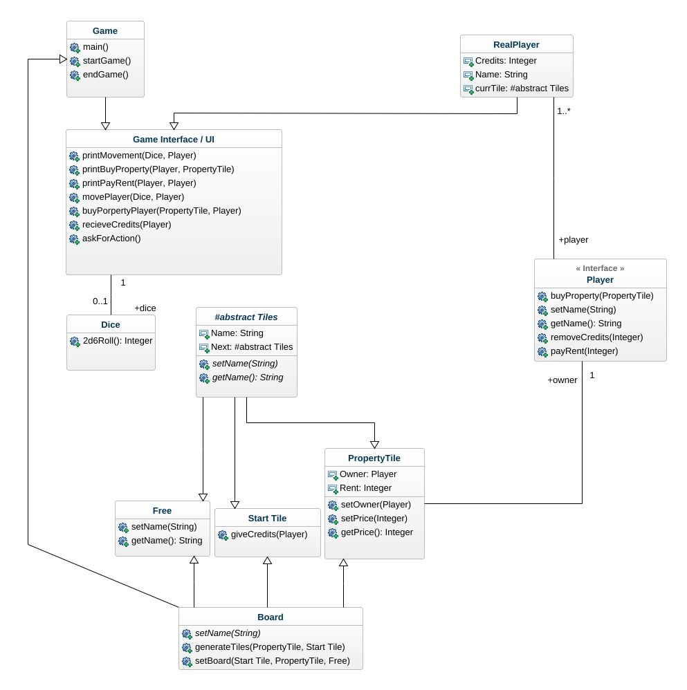
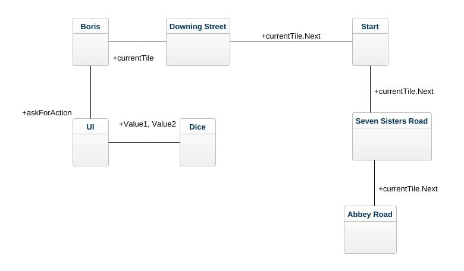
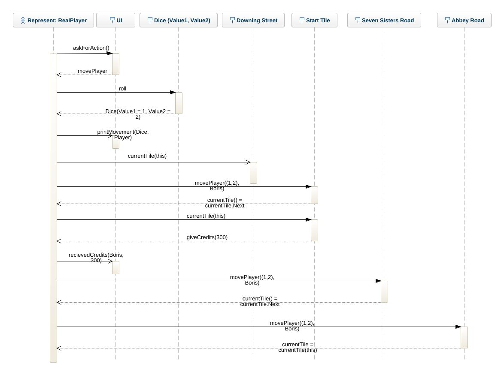

# The Indeded Desing
This is where you add your intended object oriented design of the monopoly game. The images should show when viewing the file in gitlab.  
Include the images in the repo, do not add links to external services etc.

## Class diagram
My idea was to create an abstract class called ``Tiles``, and then create classes for all different types of tiles because wanted to define the functionality between the tiles. Also i have a ``Board`` class to create and set the board in the very same class, i feel its less time consuming. I also created a ``Player Interface``. I did this because i felt its more efficient aswell since i was going to have multiple ``realPlayer`` instances. 


## Object diagram
My object diagram asks the user for their action when on a tile, and if they want to roll, they move x amount of steps, each step updating their ```currentTile``` and updating ```currentTile.Next``` each step forward. 


## Sequence diagram
This sequence diagram shows a real interpretation of how the sequence of the game would look if we were to play it. If the player decides to roll, they recieve a dice number and move that amout of steps, updating their current tile as the move along the board. If they move over the start tile, they recieve 300 credits, and so on. 
